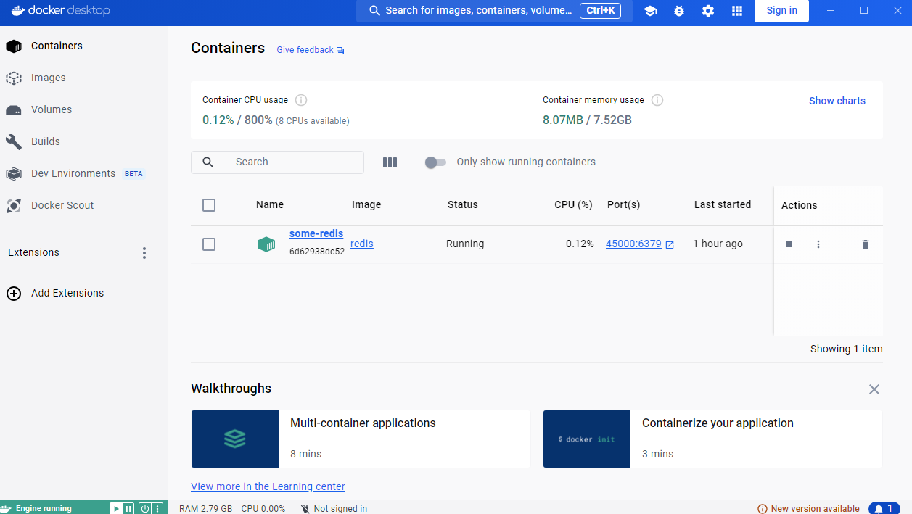
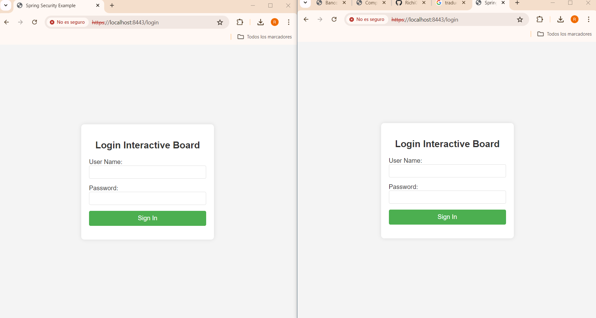
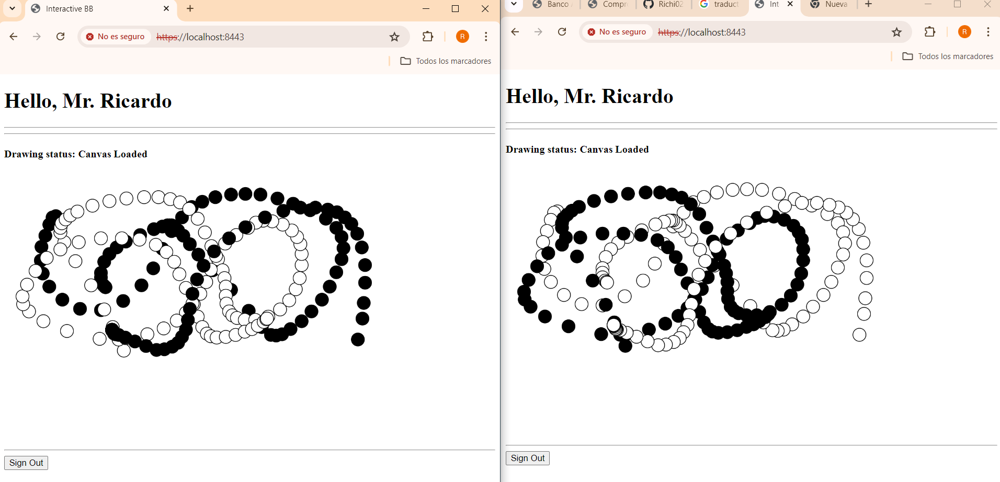
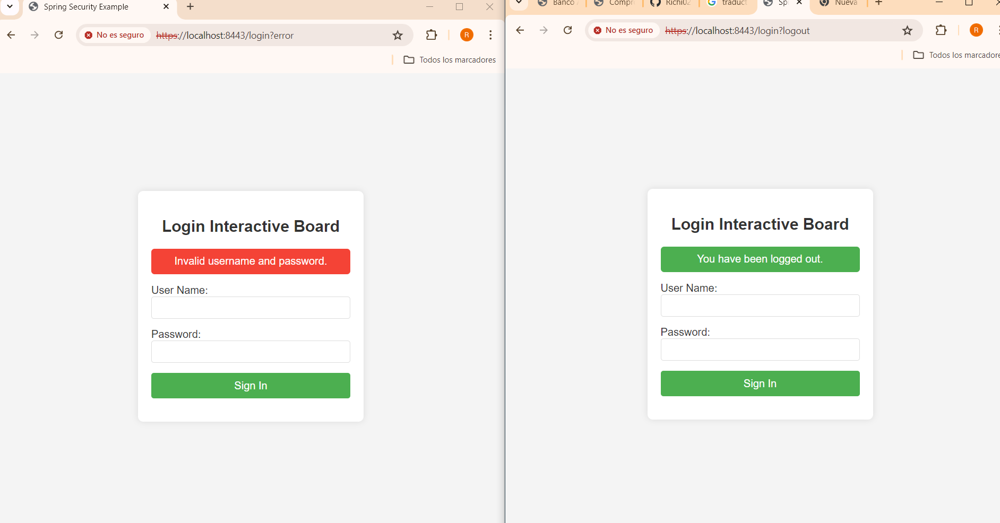
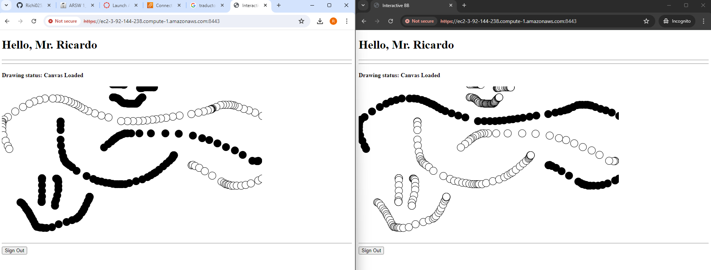
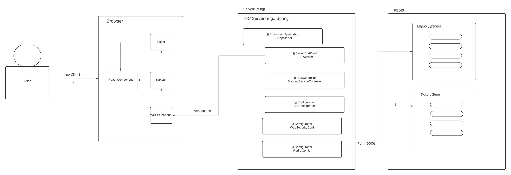

# InteractiveBlackBoard

This application is an interactive web-based whiteboard that allows multiple users to draw simultaneously on a shared canvas through a real-time connection using WebSocket technology. Additionally, it plans to implement the use of HTTPS security with a PKCS key.

On the other hand, this version of the dashboard has a login system.

### Features
- **Draw**: Allows drawing consecutive circles using mouse clicks.
- **Redis**: Uses Redis for real-time data storage.
- **Tickets**: Manages user sessions using tickets.
- **Segurity**: Implements user authentication with Spring Security and HTTPS configuration.

## Starting


In order to use the project on your system, you can access the following link and download a compressed file of it.

[Repository](https://github.com/Richi025/interactiveblackboardSegurity.git) 

You can also clone the file using the following command.

```
git clone https://github.com/Richi025/interactiveblackboardSegurity.git  
```

### Previous requirements

It is necessary to have "**Maven**", "**Java**", "**Docker**", installed, preferably in their latest versions.

#### Maven
```
Download Maven at http://maven.apache.org/download.html 

Follow the instructions at http://maven.apache.org/download.html#Installation
```
#### Java

```
Download Java at https://www.java.com/es/download/ie_manual.jsp
```

#### **Docker**
    - Install Docker by following the instructions [here](https://docs.docker.com/get-docker/)

    Verify the installation:
    ```sh
    docker --version
    ```
    Should return something like:
    ```sh
    Docker version 20.10.7, build f0df350

### Installing

Once you have the cloned project in your repository. Follow the steps below to launch the program successfully.

#### Run BackEnd Spring-boot and Run FrontEnd React Js

1. Open a terminal and enter the folder where I clone the repository and enter the BoardSpring folder.


3. **Redis (via Docker)**
    - Run Redis in a Docker container:
    ```sh
    docker run --name some-redis -p 45000:6379 -d redis
    ```

    Verify the installation:
    ```sh
    docker ps
    ```
    Should return something like:
    ```sh
    CONTAINER ID   IMAGE     COMMAND                  CREATED         STATUS         PORTS                     NAMES
    e7e2f46385d1   redis     "docker-entrypoint.s…"   2 minutes ago   Up 2 minutes   0.0.0.0:45000->6379/tcp   some-redis
    ```
    

4. Use the following command to compile and clean the target directory.
    ```
    mvn clean compile
    ```
5. Now use the following command to package the project as a JAR file.

    ```
    mvn package
    ```

6. Now you can run the project using the following command.

    ```
    mvn spring-boot:run

    Now the server is running.
    ```

7. Now there will be a browser and enter the following link and you can logging.

    http://localhost:8443/login 

    


    To start playing use one of the users:

        username = "user1"
        password ="password1"

        username = "user2"
        password ="password2"

        username = "user3"
        password ="password3"

 8. Now you can start drawing    

    

 9. Below are error messages for entering and exiting the board.

   

## Deployment in AWS

Start a browser and you will enter the following link and you can start drawing.

1. You need to use te next commands in terminal of AWS:


    sudo yum update -y
    sudo yum install -y docker
    sudo service docker start
    sudo usermod -a -G docker ec2-user


2. Next you put the file .JAR need use:

    docker ps
    docker run --name some-redis -p 45000:6379 -d redis

https://ec2-3-92-144-238.compute-1.amazonaws.com:8443/login  

 


# Proyect Structure

## Summary of Functionality with Login, HTTPS Security, Docker, and Redis

### 1. Spring Boot Server:

+ Configures and launches a WebSocket and REST server.
+ Provides a `/bbService` endpoint for WebSocket communication.
+ Provides a `/status` endpoint to check the server status.
+ Provides `/login` and `/logout` endpoints for user authentication.
+ Configures HTTPS for secure communication.

### 2. WebSocket:

+ **BBEndpoint** handles WebSocket communication: opens connections, processes messages, and manages errors.
+ Received messages are broadcast to all connected clients, except the one that sent the message.

### 3. Web Client (HTML + React + P5.js):

+ The HTML page loads React, P5.js, and the `bbComponents.jsx` component.
+ `bbComponents.jsx` defines the React components that manage the canvas and WebSocket communication.
+ Users can draw on the canvas, and the points are sent to the WebSocket server.
+ Points received from the server are drawn on the canvas of all connected clients.

### 4. User Authentication and HTTPS Security:

+ Manages user authentication with `/login` and `/logout` endpoints.
+ **WebSecurityConfig** ensures secure communication using HTTPS and manages user session security.
+ The login page (`login.html`) allows users to submit their credentials for authentication.
+ Authenticated sessions are managed by Spring Security, ensuring only authorized access to resources.

### 5. Integration with Docker and Redis
To integrate Docker and Redis into the project structure and functionality described:

 + **Dockerfile**:

    Create a Dockerfile to package your Spring Boot application into a Docker image.

+ **RedisConfig.java**:

    Update your existing Redis configuration (RedisConfig.java) to point to the Redis Docker container.

+ **application.properties**:

    Update application.properties to configure Redis connection properties.

## Architectural Design




## Component Explanation with Login and HTTPS Security

## Java Packages (co.edu.escuelaing.interactiveblackboard.configurator):

### RedisConfig.java
@Configuration class that sets up Redis connection configuration using LettuceConnectionFactory.

## Java Packages (co.edu.escuelaing.interactiveblackboard.repositories):

### TicketRepository.java
Component class handling operations with Redis for ticket management.

## Java Packages (co.edu.escuelaing.interactiveblackboard):

- ### BBApplicationContextAware.java
    - ApplicationContextAware implementation to access the Spring application context.

- ### BBConfigurator.java
    - @Configuration class enabling WebSocket endpoints with ServerEndpointExporter.

- ### BBEndpoint.java
    - @ServerEndpoint class for WebSocket endpoint (/bbService) managing WebSocket connections.

- ### DrawingServiceController.java
    - @RestController providing /status endpoint to check server status and /getticket endpoint to fetch tickets.

- ### InteractiveblackboardApplication.java
    -  @SpringBootApplication class with main method to run the Spring Boot application.

- ### MvcConfig.java
    - @Configuration class implementing WebMvcConfigurer to define view controllers for "/" and "/login".


### Spring Boot Application:

- **InteractiveblackboardApplication.java:** Entry point of the Spring Boot application. Configures and runs the Spring Boot application, specifying the port using the `getPort()` method and configuration files in `application.properties`.

### Static Resources:

- **js/bbComponents.jsx:** JavaScript file containing React components for the user interface. Uses P5.js to draw on an HTML5 canvas and WebSocket for real-time communication with the server.
- **js/loginComponents.jsx:** JavaScript file containing React components for the login interface.

### Static Files:

- **index.html:** Main HTML page of the web application. Loads React, P5.js, and babel to transpile JSX to JavaScript.
- **login.html:** HTML page for the login interface.

### Configuration File:

- **pom.xml:** Maven configuration file defining project dependencies, including Spring Boot, necessary libraries for React, WebSocket, and Spring Security.

### Data Flow:

1. **WebSocket Connection:** The client establishes a WebSocket connection with the server.
2. **Drawing Data (x, y):** When a user draws on the canvas, the position data (x, y) is sent to the server via WebSocket.
3. **Broadcasting Data:** The server broadcasts this data to all other connected clients, updating their canvases in real-time.
4. **Acknowledgment / Error Handling:** The server may send acknowledgments or handle errors as needed during data transmission.
5. **User Authentication:**
    - **Login:** Users submit their credentials via the login interface. The `LoginController` handles authentication.
    - **Session Management:** Once authenticated, the user session is managed by Spring Security.
6. **HTTPS Security:** All communication, including WebSocket, REST endpoints, and static resource access, is secured using HTTPS configured in `WebSecurityConfig`.


## Built with

* [Maven](https://maven.apache.org/) - Dependency management
* [java](https://www.java.com/es/) - Programming language
* [Spring boot](https://start.spring.io/) - Framework

### Technologies Used
- **Java:** Programming language.
- **Spring Boot:** Framework for building the application.
- **React:** Open-source JavaScript library for building user interfaces.
- **P5:** Creative JavaScript library for drawing graphics and animations in the web browser.
- **Redis:** In-memory database for efficient real-time data management.
- **Docker:** Platform for developing, shipping, and running applications in containers.

## Versioned

We use [Git](https://github.com/) for version control. For available versions, see the tags in this repository.

## Authors

* **Jose Ricardo Vasquez Vega** - [Richi025](https://github.com/Richi025)

## Date

Tuesday, July 16, 2024

## License

This project is licensed under the GNU license; See the [LICENSE.txt](LICENSE.txt) file for details.